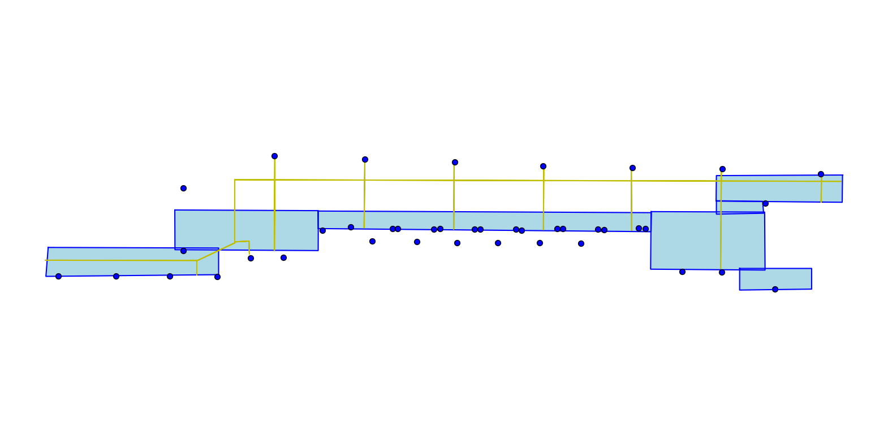

# DeMo


# Introduction

This is our publicly available data set, including some real data from online operations and data collected by offline testers. The collected data contains ground truth information.


# Structure

## config/

The configuration files for subway stations are stored in the config folder. Each station has three files: beacon.csv, freespace.npy, and tactile.npy.

### beacon.csv

| **anchor** |          **x**         |          **y**         |
|:----------:|:----------------------:|:----------------------:|
|  beacon id | coordinate x in meters | coordinate y in meters |

### freespace.npy
Freespace is the designated walkable area inside a subway station that is represented in a $2$ x $4$ x $n$ numpy array format. The $2$ represents the coordinates $(x, y)$, $4$ indicates the four vertices of the quadrilateral, and $n$ is the number of quadrilaterals. Multiple quadrangles are combined in each subway station to create indoor walkable areas that are used to limit the positioning area and to analyze the data within the area.
```
# sample
array([[[-0.00054775, -0.00052664, -0.00035847, -0.00049909,
        -0.0004724 , -0.00036172, -0.00008664, -0.00010512,
        -0.00041278, -0.00036277],
    [-0.00052687, -0.0003585 , -0.00036893, -0.00042166,
        -0.00041359, -0.00008651, -0.00003678, -0.00007734,
        -0.00039086, -0.00033903],
    [-0.0005155 , -0.00032712, -0.00033087, -0.00039133,
        -0.00034628, -0.00007418,  0.00000418, -0.0000369 ,
        -0.00033971, -0.000317  ],
    [-0.00053539, -0.00049919, -0.00032719, -0.0004725 ,
        -0.00040369, -0.00034649, -0.00007425, -0.00006309,
        -0.00036197, -0.00034019]],

    [[-0.00062059, -0.00058464, -0.00028681, -0.0006032 ,
        -0.00061917, -0.00054918, -0.0000658 , -0.00000006,
        -0.00051932, -0.00049734],
    [-0.00058462, -0.00028675, -0.0002487 , -0.00046706,
        -0.00052014, -0.00006596,  0.00002364,  0.00004647,
        -0.0004818 , -0.00045686],
    [-0.00059221, -0.00030064, -0.00023552, -0.00048288,
        -0.00055793, -0.00007329,  0.00000076,  0.00002357,
        -0.00051026, -0.00046953],
    [-0.00062738, -0.0006034 , -0.00030061, -0.00061936,
        -0.00066111, -0.00055779, -0.00007307, -0.00002337,
        -0.00054846, -0.00051025]]])
```

### tactile.npy
Tactile marks indicate the distribution of blind passages within a subway station. They are represented by a continuous line segment that can be visualized as a $2$ x $2$ x $n$ array in the numpy format, where $2$ denotes the starting coordinates of the segment $(x1, y1)$ and the ending coordinates of the segment $(x2, y2)$. $n$ denotes the number of lines in the segment. 
```
array([[[ 0.00013637,  0.00000673, -0.00007525, -0.00004835,
        -0.00020564, -0.00020645, -0.00036395, -0.0003335 ,
        -0.00041996, -0.00051109, -0.00047025, -0.00040213,
        -0.00041337, -0.00024262],
    [ 0.00000673, -0.00007525, -0.00010091, -0.00020564,
        -0.00021886, -0.00036395, -0.00038091, -0.00041996,
        -0.00051109, -0.00053883, -0.00040213, -0.00041337,
        -0.00039167, -0.00020871]],

    [[-0.00000564, -0.00004372, -0.00000007, -0.00001268,
        -0.0002897 , -0.00028833, -0.00056784, -0.00047153,
        -0.00062154, -0.00057063, -0.00059246, -0.00047965,
        -0.00047321, -0.00028452],
    [-0.00004372, -0.00000007, -0.00004747, -0.0002897 ,
        -0.00028384, -0.00056784, -0.00055823, -0.00062154,
        -0.00057063, -0.00061821, -0.00047965, -0.00047321,
        -0.00043214, -0.00022406]]])
```
####visualization
You can utilize the aforementioned information to create a visual map using the drawing tool.


## gt/
The gt folder contains experimental data collected by the tester. Map information can be loaded using the folder name to reproduce and locate results.

### beacon.csv
|              **rssi**              |           **ts**           | **anchor** |
|:----------------------------------:|:--------------------------:|:----------:|
| received signal strength indicator | unti timesstamp in seconds |  beacon id |

### accelerometer.csv | gyroscope.csv | magnetic_field.csv
IMU raw data.

### gt_pos.csv
gt_pos, a $2$ x $n$ $ numpy array, records the reference coordinates (x,y) of check points during data acquisition.
```
array([[-41.14965366, -32.81245066, -26.1697219 , -11.66052001,
         -5.9941093 ,  -0.83996356,   4.28491114,   9.45875508,
         14.50891348,  19.68122109,  24.80018725],
       [ -4.10485298,  -4.10485298,   1.77624333,   1.73704559,
          1.66486207,   1.58609076,   1.58745847,   1.57226301,
          1.55030843,   1.51252224,   1.44063533]])
```
### gt_t.csv
The passage time of each checkpoint is recorded in data acquisition, represented as a $1$ x $n$ numpy array. The reference time is recorded in gt_t. 
```
array([4352598.79699993, 4352607.54399991, 4352617.1730001 ,
       4352630.62199998, 4352635.80699992, 4352640.37400007,
       4352645.03800011, 4352649.58999991, 4352653.85700011,
       4352658.25      , 4352662.91000009])
```

## real/
The real folder contains some real operational data.